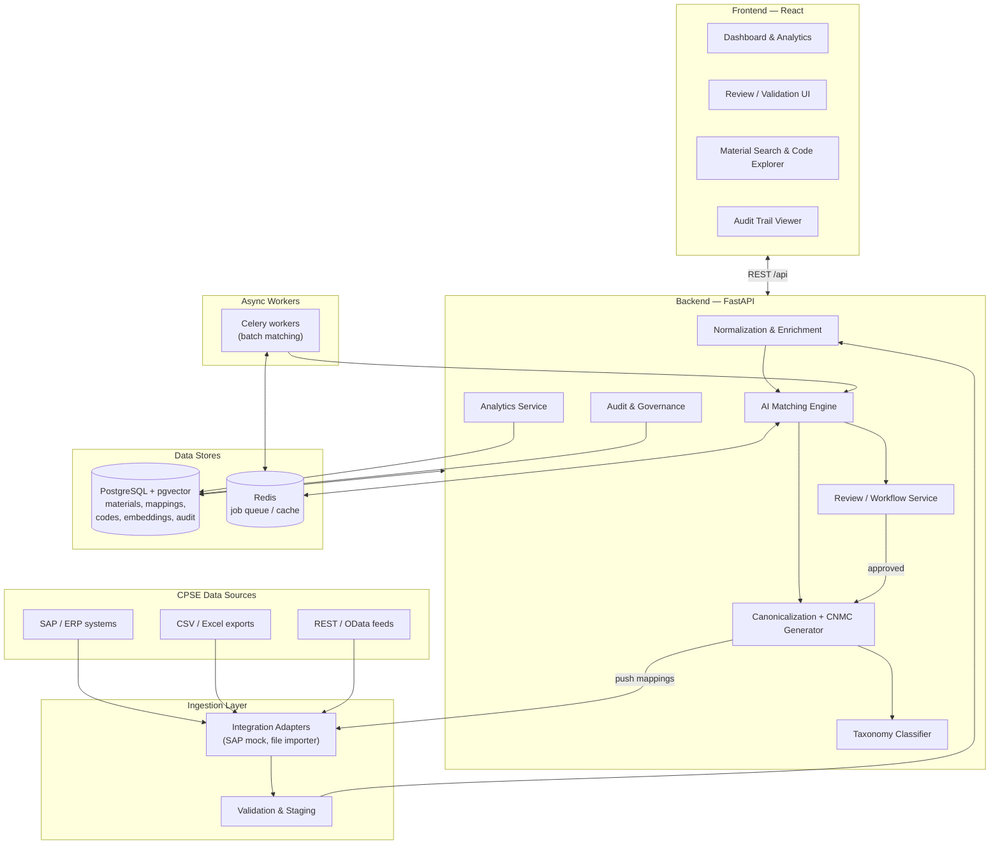
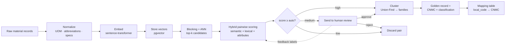
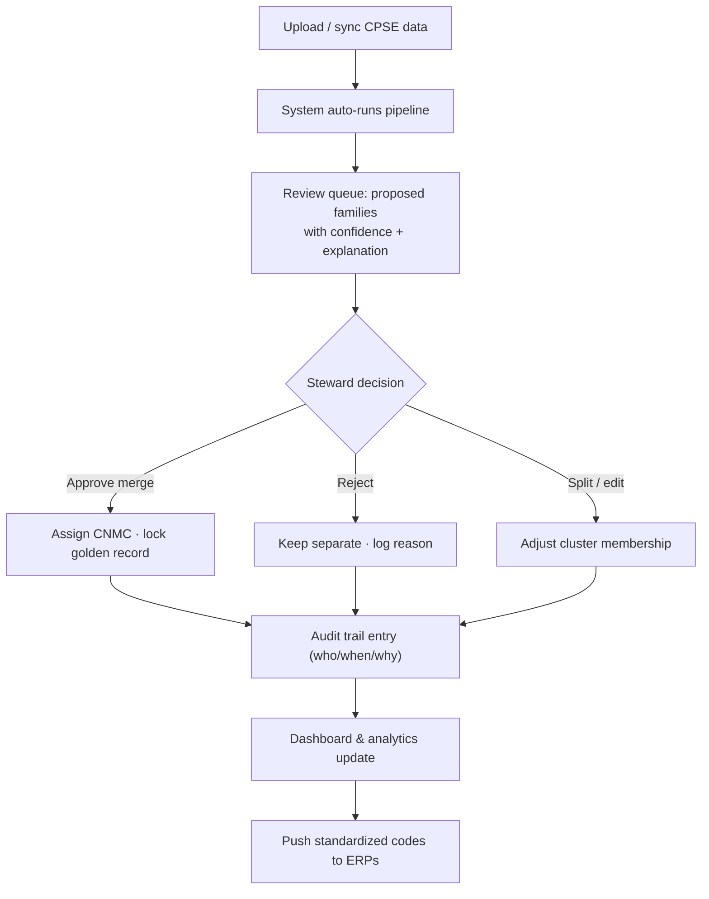

# SAMANVAY — AI-Driven Standardization & Harmonization of Material Codes Across CPSEs

> **SIH 2026 · Problem Statement ID `26099`**
> **Organization:** Ministry of Petroleum & Natural Gas → **Chennai Petroleum Corporation Limited (CPCL)**
> **Category:** Software · **Theme:** Smart Automation
> **Dataset:** CPSE Material Master Data (sample dataset to be provided by participating CPSEs)

*"Samanvay" (समन्वय) = "harmonization / coordination" in Sanskrit/Hindi — our proposed product name. Tagline: **One Nation · One Material Code**. (Name is a suggestion — swap freely.)*

---

## 1. The Problem (captured from the SIH portal)

### Background
Central Public Sector Enterprises (CPSEs) in **Oil & Gas, Power, Steel, Mining and Heavy Engineering** procure and maintain huge numbers of **similar or functionally-equivalent materials**. The *same* physical item is assigned **different material codes, descriptions, specifications, units of measure (UOM) and classifications** across different CPSEs (and even within one CPSE).

This causes:
- Duplication of material masters
- Inconsistent descriptions
- Difficulty identifying equivalent materials
- Fragmented procurement data
- Higher inventory levels
- Lost opportunities for **collaborative / aggregated procurement**

### What they want built
An **AI-powered National Unified Material Master Framework** that analyses material codes, descriptions, specifications, technical parameters and historical procurement data from multiple CPSEs, and uses **AI / ML / NLP** to identify **identical, duplicate, near-duplicate and functionally-equivalent** materials across different **ERP / SAP** systems — then recommends a **standardized description + a Common National Material Code**, while **retaining a mapping back to each CPSE's existing code**. It must support **human review/validation**, **legacy code migration**, and **SAP/ERP integration**.

### The 8 required capabilities / modules
1. **AI Material Matching & Recommendation**
2. **Material Standardization & Classification**
3. **Duplicate / Near-Duplicate Detection**
4. **Common National Material Code Generation**
5. **CPSE Code Mapping & Migration Support**
6. **Material Master Dashboard & Analytics**
7. **Audit Trail & Governance**
8. **SAP / ERP Integration**

### Expected impact (their words)
One Nation–One Common Material Code · fewer duplicate/redundant codes · better data quality · inventory optimization · lower procurement cost via demand aggregation · better inter-CPSE collaboration · faster procurement · data-driven decisions.

> **Translation into CS terms:** this is a **Master Data Management (MDM)** problem whose core is **entity resolution / record linkage / deduplication** over short, noisy technical text + structured attributes, followed by **canonicalization** (golden records) and **taxonomy classification** — wrapped in a **human-in-the-loop review workflow** with **governance** and **ERP connectors**.

---

## 2. Our Solution — What We Are Building

A full-stack web platform where a **data steward** at a central body (think DGS&D / GeM / a Nodal CPSE) can:

1. **Ingest** material master exports from many CPSEs (CSV/Excel/API/SAP).
2. **Auto-normalize & enrich** the messy records (units, abbreviations, spec extraction).
3. Run an **AI matching engine** that groups records into **"material families"** (clusters of the same/equivalent item) with an **explainable confidence score**.
4. **Review & approve** proposed merges in a purpose-built UI (accept / reject / split).
5. On approval, generate a **canonical golden record** + a **Common National Material Code (CNMC)** and keep a **mapping table** `(CPSE, local_code) → CNMC`.
6. **Classify** every material into a standard taxonomy (UNSPSC-based).
7. See it all on a **dashboard**: duplication rate, potential savings from demand aggregation, data-quality score, category spread.
8. Push results back to CPSE ERPs via a **SAP/ERP adapter** and keep a full **audit trail**.

Every one of the 8 required modules maps 1:1 to a part of this system (see §5 flowcharts).

---

## 3. How the AI Works (the heart of the project)

The matching engine is a **hybrid entity-resolution pipeline** — not "just embeddings," because pure embeddings over-merge (e.g. `M10 bolt` vs `M12 bolt` look nearly identical). We combine **semantic + lexical + structured-attribute** signals so matches are **accurate and explainable**.

**Step-by-step:**

1. **Normalization & enrichment** — lowercase, expand abbreviations (`BRG→BEARING`, `SS→STAINLESS STEEL`), standardize UOM (`NOS/EA/PCS→EACH`, `MTR→METER`), parse out structured specs from free text via regex + spaCy NER (size `M10`, `Ø25`, `6205`, grade `SS304`, thread `1/2"NPT`, rating `PN16`).

2. **Embedding** — encode the cleaned description with a **sentence-transformer** (`all-MiniLM-L6-v2`, 384-d, CPU-friendly). Store vectors in **Postgres via `pgvector`**.

3. **Blocking / candidate generation** — never compare all N² pairs. Use **ANN vector search** (pgvector / FAISS) + cheap blocking keys (category + first token + UOM) to fetch the top-k candidate neighbours per record. This is what makes it scale to **millions** of records.

4. **Pairwise hybrid scoring** — for each candidate pair compute features:
   - semantic cosine similarity (embeddings)
   - lexical similarity (RapidFuzz token-set ratio, Jaro-Winkler)
   - attribute agreement (UOM match, numeric spec within tolerance, grade/material match)
   - category match
   Combine via a **weighted score** (fast MVP) or a **trained gradient-boosted classifier / XGBoost** on labeled pairs (better, gives calibrated probability).

5. **Clustering into material families** — build a graph of high-confidence pairs and take **connected components (Union-Find)**, refined with a threshold so we don't chain unrelated items. Each component = one candidate "material family."

6. **Canonical (golden) record + CNMC** — for each family, synthesize a **standardized description** (attribute-template rules, optionally an LLM for phrasing) and assign a **Common National Material Code** (see §4). Store `local_code → CNMC` mappings.

7. **Classification** — map each family to a **UNSPSC** class (embedding + classifier, or LLM zero-shot) for "Intelligent classification & categorization."

8. **Human-in-the-loop + active learning** — proposals go to the review UI. Steward decisions (approve/reject/split) are **logged (audit)** and **fed back as new labels** to improve the scorer over time.

9. **Explainability** — every proposal shows *why*: "desc 0.94 · UOM ✅ · size M10=M10 ✅ · grade SS304=SS304 ✅ → 96% confident duplicate." Critical for trust and for the demo.

**Why this wins on accuracy:** we can report real **precision / recall / F1** against a ground-truth-labeled synthetic dataset, and the hybrid approach avoids the classic failure of naive semantic matching.

---

## 4. The "Common National Material Code" (CNMC) Scheme

A structured, human-parseable, checksummed code anchored to the global **UNSPSC** standard so it's credible to judges and future-proof:

```
IN - <SSFFCC> - <NNNNNNN> - <K>
│      │           │          └─ check digit (mod-11) → catches typos
│      │           └──────────── 7-digit unique serial within the class
│      └──────────────────────── 6-digit UNSPSC class (Segment|Family|Class)
└─────────────────────────────── country prefix (India)

Example:  IN-311516-0000042-7   →  a specific 6205-ZZ ball bearing
```

- **Traceability preserved:** a mapping table keeps every CPSE's original code linked to the CNMC, so nothing breaks in their existing systems ("One Nation–One Code" *with* backward compatibility).
- Codes are **never reused**; retired/merged codes stay as aliases (governance requirement).

---

## 5. Flowcharts

> These are Mermaid diagrams — they render in VS Code (Markdown Preview Mermaid extension), on GitHub, and in `docs/diagrams/flowcharts.html`.

### 5A. System Architecture



### 5B. AI Matching Pipeline (data flow)



### 5C. Data Steward Workflow



---

## 6. Tech Stack

| Layer | Choice | Why |
|---|---|---|
| **Frontend** | React 18 + **Vite** + TypeScript, **Tailwind + shadcn/ui**, TanStack Query, TanStack Table (big grids), **Recharts** (analytics) | Fast, modern, great for data-dense review UIs & dashboards |
| **Backend API** | **Python 3.11 + FastAPI**, Pydantic, SQLAlchemy 2, Alembic (migrations) | Python is mandatory for the ML; FastAPI is async, typed, auto-docs (Swagger) — great for demos |
| **Database** | **PostgreSQL 16 + `pgvector`** | One store for relational data *and* vector search — clean architecture, no separate vector DB needed |
| **ML / NLP** | `sentence-transformers` (all-MiniLM-L6-v2), **RapidFuzz**, **spaCy**, scikit-learn, **XGBoost**, pandas, NumPy; FAISS optional | Hybrid matching: semantic + fuzzy + structured; all run on CPU |
| **Async jobs** | **Celery + Redis** (RQ is fine for MVP) | Batch matching over large datasets without blocking the API |
| **Auth / RBAC** | JWT, roles: Steward / Admin / Viewer | Governance & audit require identity |
| **Integration** | Adapter pattern; **mock SAP OData/REST stub** + CSV/Excel importer; documented real path (SAP OData, or BAPI/RFC via `pyrfc`, or IDoc/file) | Can't touch real SAP in a hackathon — simulate cleanly, show the seam |
| **LLM (optional, pluggable)** | Claude API for canonical-description phrasing / zero-shot classification, **with deterministic rules fallback** | "AI-powered" polish, but never breaks the offline demo |
| **DevOps** | **Docker + docker-compose** (one-command demo), GitHub, pytest | `docker compose up` → whole system runs; reproducible for judges |

> **Note:** You have a React+Vite app in `dream-atlas` already — same frontend stack, so the team's existing muscle memory transfers. (That project used JS; I recommend **TypeScript** here for a data-heavy app, but JS is acceptable.)

---

## 7. Data Strategy & Data Model

### 7.1 The dataset problem (important)
The official dataset is *"to be provided by participating CPSEs"* — you likely **won't have it early**, and even at the finale it may be small/partial. **Mitigation: build a synthetic data generator** (`scripts/gen_synthetic_data.py`) that produces realistic messy material masters **with known ground-truth duplicate groups**. This gives you (a) something to build on today, and (b) **labeled data to report precision/recall** — a huge credibility win with judges. Seed it with real categories (bearings, valves, fasteners, pipes, cables, pumps, gaskets) and inject realistic noise: abbreviations, typos, reordered tokens, UOM variants, extra/missing specs, multiple "vendors."

### 7.2 Core tables (simplified)

```
cpse(id, name, sector)
material_raw(id, cpse_id, local_code, description, uom, specs_json, category_raw, price, source_file)
material_norm(id, raw_id, clean_desc, uom_std, attributes_json, embedding vector(384))
match_pair(id, a_id, b_id, semantic, lexical, attr_score, total_score, model_version)
cluster(id, status[proposed|approved|rejected], confidence)
cluster_member(cluster_id, material_id)
canonical_material(id, cluster_id, cnmc, std_description, unspsc_class, attributes_json)
code_mapping(id, cnmc, cpse_id, local_code)          -- traceability
review(id, cluster_id, user_id, action, reason, ts)  -- feeds audit + active learning
audit_log(id, entity, entity_id, action, user_id, before_json, after_json, ts)
users(id, name, role)
```

---

## 8. File & Folder Structure (monorepo)

```
samanvay/
├─ README.md
├─ docker-compose.yml            # postgres+pgvector, redis, backend, worker, frontend
├─ .env.example
├─ docs/
│  ├─ PROJECT_PLAN.md            # this file
│  ├─ data-model.md
│  ├─ national-code-scheme.md
│  └─ diagrams/flowcharts.html   # renders the Mermaid diagrams in a browser
│
├─ data/
│  ├─ synthetic/                 # generated data + ground_truth.csv
│  ├─ raw/                       # real CPSE exports when available
│  └─ reference/                 # UNSPSC subset, UOM map, abbreviation dictionary
│
├─ backend/
│  ├─ app/
│  │  ├─ main.py                 # FastAPI entrypoint
│  │  ├─ core/                   # config, security(JWT), db session
│  │  ├─ models/                 # SQLAlchemy ORM
│  │  ├─ schemas/                # Pydantic request/response
│  │  ├─ api/                    # routers: auth, ingest, materials, matches,
│  │  │                          #          clusters, codes, review, analytics, audit
│  │  ├─ services/               # business logic per domain
│  │  ├─ ml/
│  │  │  ├─ normalize.py         # cleaning, UOM, abbreviations, spec extraction
│  │  │  ├─ embed.py             # sentence-transformer wrapper
│  │  │  ├─ block.py             # blocking / ANN candidate generation
│  │  │  ├─ score.py             # hybrid pairwise scoring
│  │  │  ├─ cluster.py           # Union-Find clustering
│  │  │  ├─ canonical.py         # golden record + CNMC generator
│  │  │  ├─ classify.py          # UNSPSC classification
│  │  │  └─ explain.py           # per-match feature attribution
│  │  ├─ integrations/           # sap_adapter.py, file_importer.py
│  │  ├─ workers/                # celery_app.py, tasks.py
│  │  └─ tests/
│  ├─ alembic/                   # DB migrations
│  ├─ requirements.txt
│  └─ Dockerfile
│
├─ frontend/
│  ├─ src/
│  │  ├─ pages/                  # Login, Dashboard, Upload, Review, Materials,
│  │  │                          # Clusters, CodeExplorer, Analytics, Audit
│  │  ├─ components/             # tables, charts, match-explanation card, etc.
│  │  ├─ features/               # api hooks (TanStack Query) per domain
│  │  ├─ lib/                    # api client, auth, formatters
│  │  └─ types/
│  ├─ package.json
│  └─ Dockerfile
│
├─ ml/
│  ├─ eval/                      # precision/recall/F1 harness vs ground truth
│  └─ notebooks/                 # experiments, threshold tuning
│
└─ scripts/
   ├─ gen_synthetic_data.py      # messy data + ground truth generator
   └─ seed_db.py
```

*(For the hackathon, ML lives inside the backend as one Python service — simplest to deploy. It can later be split into a separate microservice; the code is already isolated under `app/ml/`.)*

---

## 9. Build Roadmap (phased)

| Phase | Goal | Deliverable |
|---|---|---|
| **P0 — Foundations** | Repo, docker-compose, DB schema, auth skeleton, **synthetic data generator + ground truth** | `docker compose up` runs; data loaded |
| **P1 — Matching MVP** | Normalize → embed → block → weighted score → Union-Find clusters; eval harness prints precision/recall | End-to-end dedup on synthetic data with a metric |
| **P2 — Review + Codes** | Review/validation UI, approve/reject/split, CNMC generation, mapping table, audit log | Human-in-the-loop loop closes; codes assigned |
| **P3 — Dashboard + Classify** | Analytics (duplication %, savings estimate, category spread), UNSPSC classification, search/code explorer | The "wow" screen for judges |
| **P4 — Integration + Polish** | SAP mock adapter (import + push-back), XGBoost scorer w/ active learning, explainability cards, optional LLM standardization, pitch deck & demo script | Finale-ready |

> Order by **judge impact**: a working **explainable matcher + metrics + dashboard** beats a half-built everything. Get P1→P3 rock-solid before P4 stretch items.

---

## 10. Suggested Team Roles (6 members)

1. **ML / NLP Lead** — matching engine, embeddings, scoring, eval metrics.
2. **Backend Lead** — FastAPI, DB/models, API, Celery workers, auth.
3. **Frontend Lead** — review/validation UI, material grids, search.
4. **Frontend / Full-stack #2** — dashboard, analytics charts, code explorer.
5. **Data Engineer** — synthetic generator, normalization dictionaries, UNSPSC/UOM reference data, SAP adapter.
6. **Team Lead / PM** — architecture, governance & audit, integration story, **pitch + demo script + docs**.

---

## 11. Demo Strategy (how to win the room)

1. **Open on the pain:** show 5 raw rows from 3 CPSEs — all the *same* bearing, coded 5 different ways, 5 different prices.
2. **One click → pipeline runs →** proposed family appears with an **explanation card** ("96% — desc 0.94, UOM✓, size M10✓").
3. **Steward approves →** CNMC `IN-311516-0000042-7` assigned; mapping table shows all 5 local codes now point to it.
4. **Dashboard:** "Duplication reduced 34% · ₹X potential savings from demand aggregation · data-quality score ↑."
5. **Show the seam:** SAP mock adapter pushes the standardized code back.
6. **Land the metric:** "On a 10k-record labeled set: **precision 0.9x / recall 0.9x**."

---

## 12. Differentiators (why ours stands out)

- **Explainable hybrid matching** (semantic + lexical + attributes) — not a black box; avoids naive-embedding over-merge.
- **Real metrics** via a ground-truth synthetic dataset — most teams can only *claim* accuracy.
- **pgvector single-store architecture** — elegant, scalable, easy to reason about.
- **UNSPSC-anchored CNMC with checksum + full traceability** — credible, standards-based.
- **Human-in-the-loop with active learning** — the model *improves* from steward decisions.
- **Business-impact analytics** — quantified savings, not just tech.
- **Governance & audit built-in** — enterprise-grade, matches a government buyer's real concerns.

---

## 13. Risks & Things to Know

| Risk | Mitigation |
|---|---|
| Official dataset unavailable/late | Synthetic generator with ground truth (build now; also enables metrics) |
| Real SAP integration impossible in hackathon | Adapter pattern + mock OData source + documented real path (OData / pyrfc / IDoc) |
| Embeddings over-merge similar-but-different items (M10 vs M12) | Hybrid scoring + attribute/spec agreement + tolerance rules |
| Scale to millions of records | Blocking + ANN (O(N·k) not O(N²)); batch Celery jobs; demo on representative subset but design scales |
| False merges are costly | Never auto-merge low-confidence; human review; confidence bands; reversible with audit |
| LLM features flaky offline | Deterministic rules fallback; LLM strictly optional/pluggable |
| Scope creep across 8 modules | Follow the phase order; P1–P3 solid before P4 |

---

## 14. Decisions to Confirm (before we start coding)

1. **Team:** how many members and what skills (Python? React?) — tunes the plan.
2. **Data:** any real sample yet, or synthetic-only for now?
3. **Frontend language:** TypeScript (recommended) or JS (as in your `dream-atlas`)?
4. **LLM use:** allowed to call Claude API for description standardization/classification, or keep fully offline/deterministic for the demo?
5. **Deployment:** local `docker compose` demo only, or also deploy to a cloud URL?
6. **Product name:** keep **Samanvay**, or pick another?

---

*Next step after you review this: I can scaffold the repo in `sih2/` — docker-compose, DB schema, the synthetic data generator, and a working end-to-end matching MVP (P0→P1) — so you have something running to build on.*
